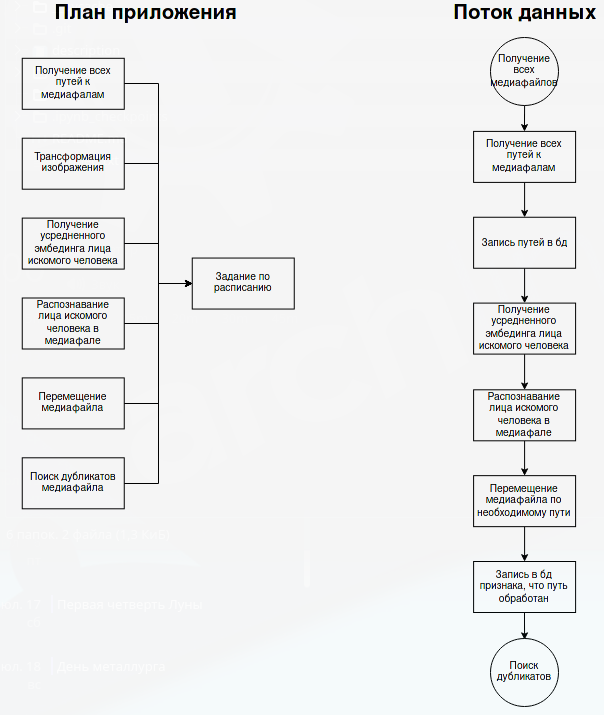

# Распознавание лица искомого человека на медиафале и перемещение медиафайла


# DDL 
```
CREATE TABLE sort_media."path" (
	"path" varchar NULL,
	file varchar NULL,
	file_name varchar NULL,
	"type" varchar NULL,
	is_processed bool NULL,
	date_load information_schema.timestamp NULL,
	CONSTRAINT path_pk PRIMARY KEY (path)
);
COMMENT ON TABLE sort_media."path" IS 'Пути к медиафайлам';

-- Column comments

COMMENT ON COLUMN sort_media."path"."path" IS 'Путь к файлу';
COMMENT ON COLUMN sort_media."path".file IS 'Полное наименование файла';
COMMENT ON COLUMN sort_media."path".file_name IS 'Наименование файла';
COMMENT ON COLUMN sort_media."path"."type" IS 'Тип файла';
COMMENT ON COLUMN sort_media."path".is_processed IS 'Признак обработанных файлов';
COMMENT ON COLUMN sort_media."path".date_load IS 'Дата загрузки';
```